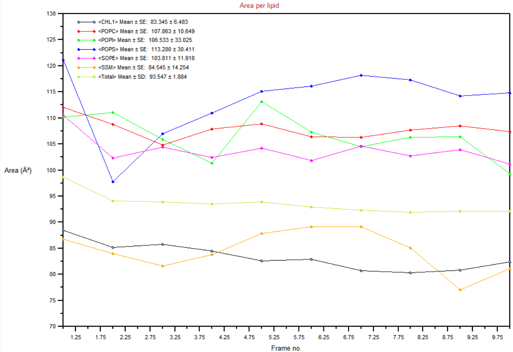

# Part B: Asymmetrical Bilayer with Glycolipids

This project tackles a more advanced and biologically relevant system: an asymmetric lipid bilayer containing glycolipids. The goal was to build a membrane mimicking a specific composition from the literature (e.g., Jumin Lee et al.) and to use advanced analysis to validate its properties.

---

## Workflow Overview

1.  **System Building with CHARMM-GUI:** The asymmetric system was constructed using CHARMM-GUI, specifying different lipid and glycolipid compositions for the upper and lower leaflets based on a published model.

2.  **Multi-step Equilibration:** The standard multi-step equilibration protocol provided by CHARMM-GUI was used to carefully relax this complex, heterogeneous system.

3.  **Production MD:** A production simulation was run to collect data for analysis.

4.  **Advanced Analysis & Refinement:** A key part of this project was to validate the initial composition. The Area Per Lipid (APL) was calculated using the Voronoi tessellation method to assess the packing of the leaflets. Based on these results, the composition could be iteratively refined to better match experimental targets.

---

## Key Results & Analysis

### Membrane Properties: Area per Lipid (Voronoi Tessellation)

The Area Per Lipid (APL) for the outer leaflet was calculated using the Voronoi tessellation method, which is well-suited for multi-component bilayers. The analysis aimed to verify if the initial literature-based composition resulted in a physically realistic APL. The plot below shows the APL over time.

---

## Conclusion

This project demonstrates the ability to construct and simulate complex, asymmetric bilayers. It highlights proficiency in advanced analysis techniques like Voronoi APL calculations and, more importantly, showcases the critical thinking process of validating a simulation against known properties and proposing refinements to the model.
